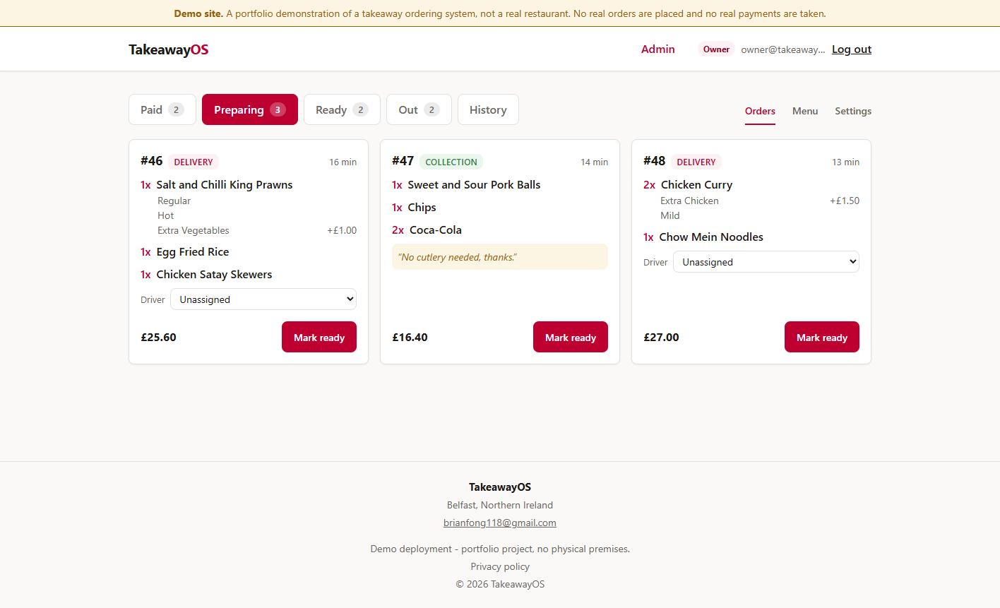
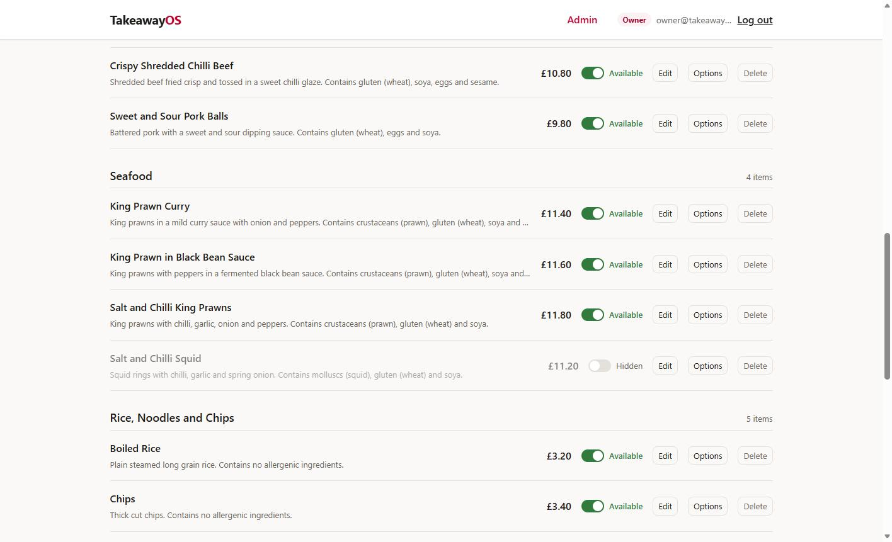
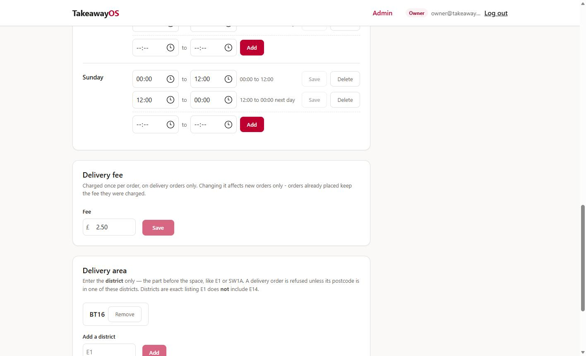
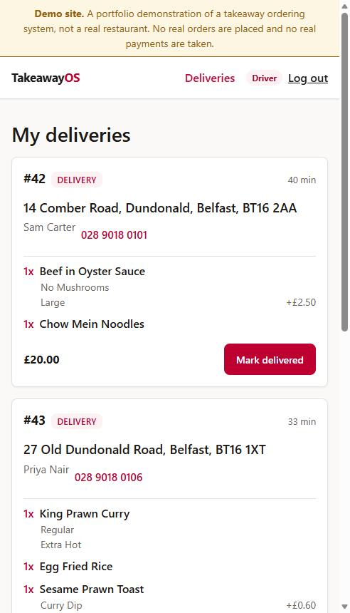

# TakeawayOS

Online ordering and order management for an independent takeaway : menu, basket, priced modifiers,
Stripe checkout, and separate owner and driver dashboards.

**[Live demo](https://takeaway-os-sage.vercel.app/)**

Built in C# and React for a real business (my parents' takeaway) to replace telephone-only ordering.
The shop closed before launch, so it is deployed as a demo instead. It runs on Stripe **test keys**, so
no real payment can be taken.



## Try it

The customer side is fully open: browse, build a basket, check out as a guest or with an account, pay.

| Test card | Result |
|---|---|
| `4242 4242 4242 4242` | Succeeds |
| `4000 0000 0000 0002` | Declined |

Any future expiry, any CVC. Also shown on the payment page.

- **First load can take ~1 minute** as the API sleeps on its free tier and has to wake up.
- **Delivery is limited to the `BT16` district.** Use `BT16 1AA` to get through; anything else is
  refused, which is the radius check doing its job.

## Features

- Guest checkout by default, with optional accounts for saved addresses and order history
- Priced modifier groups per item, required single-select, optional multi-select, zero-cost options
- Stripe payments, confirmed by webhook rather than by the browser
- Owner: menu and category management, modifier groups, opening hours, delivery fee and districts
- Driver dashboard with per-order delivery actions
- Order status flow: `Pending → Paid → Preparing → Ready → (OutForDelivery →) Completed`
- Server-enforced opening hours, delivery radius, and a one-off closure override

## Screenshots

| Menu management | Settings |
|---|---|
|  |  |
| Disabling an item is a soft delete, hidden from customers, reversible here | Delivery fee and districts; both fail closed when unset |

Driver dashboard — phone-first, one action per order:




Staff logins aren't published: there is one owner account, and a public password for it would let any
visitor rewrite the menu.

## Tech stack

ASP.NET Core Web API (.NET 10) · EF Core 10 · PostgreSQL · ASP.NET Core Identity + JWT · Stripe.net ·
React + Vite · xUnit · Render + Vercel

## Running locally

Requires .NET 10, Node, and PostgreSQL.

```bash
# API from /Takeaway-OS.API
dotnet user-secrets set "ConnectionStrings:DefaultConnection" "Host=localhost;Port=5432;Database=Takeaway-OS;Username=postgres;Password=..."
dotnet user-secrets set "JWT_SECRET" "at-least-32-characters-long"
dotnet run          # migrations run automatically at startup

# Frontend from /Takeaway-OS.Frontend
npm install && npm run dev

# Tests from the repo root
dotnet test
```

A fresh database refuses every order until it is seeded as no opening hours means permanently closed,
no delivery districts means no deliveries, and the delivery fee starts at `0.00`. 
The seed scripts in `Takeaway-OS.API/Data` are safe to re-run:

```bash
psql ... -f Data/seed-demo-menu.sql       # menu, categories, modifiers
psql ... -f Data/seed-demo-settings.sql   # hours, districts, delivery fee
psql ... -f Data/seed-demo-orders.sql     # orders across every status
```

Stripe is optional in development , w/o `STRIPE_SECRET_KEY` the app still runs and only order
creation fails.

## Notable decisions

- **Prices and delivery fees are snapshotted onto orders**, not referenced, so changing the menu never
  rewrites what a past order cost
- **Stripe's webhook is the only path to `Paid`**, signature-verified and idempotent, because a
  browser claiming success can be forged or lost
- **Totals are computed server-side**, and mirrored on the client in exactly one function
- **Guests read their order via a random capability token**, since sequential ids would expose every
  customer's details
- **Opening-hours windows can cross midnight**, so overlap is checked on a circular weekly timeline
- **Delivery districts match on exact equality, never prefix** — `E1` must not also match `E14`

## Known limitations

- Allergen text lives in item descriptions, so it reaches the menu but not the order or the driver
- Pending (unpaid) orders appear on no owner screen
- No password reset, and no route to create a second owner
- `GET /api/orders` is unpaginated
- Waiting times are measured from creation — there is no `PaidAt` column
- No email or SMS: a guest's only record is their confirmation link
- On the demo, nothing advances an order past `Paid` — no one is logged in to press the next button
